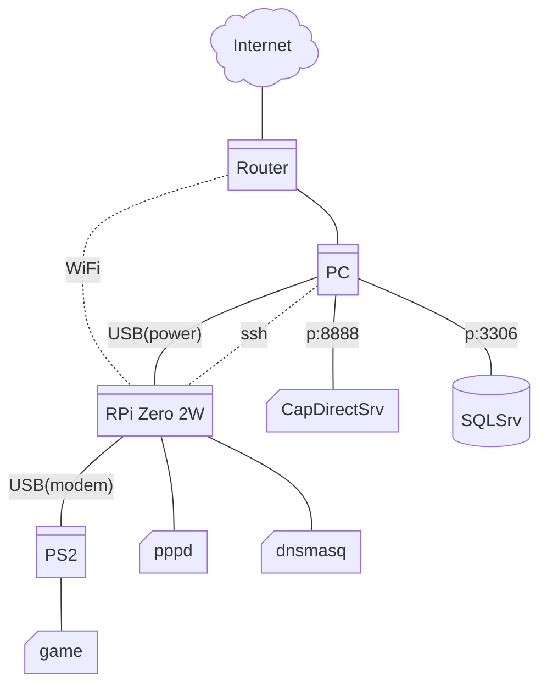
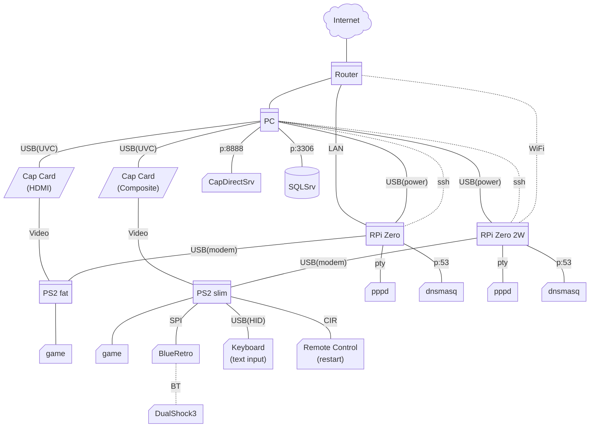

- Raspberry PI Zero 2W
```shell
sudo apt install git iptables-persistent dnsmasq

# compile raw-gadget
git clone https://github.com/xairy/raw-gadget.git ~/raw-gadget
make -C ~/raw-gadget/raw_gadget
# sudo insmod ~/raw-gadget/raw_gadget/raw_gadget.ko

# install raw_gadget
sudo mkdir -p /lib/modules/$(uname -r)/extra
sudo cp ~/raw-gadget/raw_gadget/raw_gadget.ko /lib/modules/$(uname -r)/extra/
sudo depmod -a
sudo modprobe raw_gadget
grep -qxF dwc2 /etc/modules || echo dwc2 | sudo tee -a /etc/modules
grep -qxF raw_gadget /etc/modules || echo raw_gadget | sudo tee -a /etc/modules

# register client credentials
echo "user * pass *" | sudo tee /etc/ppp/pap-secrets
echo "mmducp1 * cpcm1 *" | sudo tee -a /etc/ppp/pap-secrets

# DNS redirect
echo "interface=ppp0"                       | sudo tee    /etc/dnsmasq.conf
echo "bind-dynamic"                         | sudo tee -a /etc/dnsmasq.conf
echo "address=/ca1201.mmcp6/192.168.100.14" | sudo tee -a /etc/dnsmasq.conf
sudo systemctl restart dnsmasq

# compile me56ps2-emulator
git clone https://github.com/msawahara/me56ps2-emulator.git ~/me56ps2-emulator
make -C ~/me56ps2-emulator rpi-zero2
sudo ~/me56ps2-emulator/me56ps2 -s 0.0.0.0 10023
```
- PC drivers
  - Omron Viaggio (ME56PS2)
    - Windows: https://web.archive.org/web/20050309011724/http://www.omron.co.jp/ped-j/download/me56ps2ws/me56ps2ws.htm
    - Linux: `sudo modprobe ftdi_sio ; echo 0590 001a | sudo tee /sys/bus/usb-serial/drivers/ftdi_sio/new_id`
  - Suntac OnlineStation (MS56KPS2)
    - Windows: https://www.sun-denshi.co.jp/sc/suntac/download/modem/ms56kps2/firmup.html
    - Linux 2.4: https://x68trap.no.coocan.jp/linux/suntacucp.html
    - BSD: https://github.com/openbsd/src/blob/ee05ec4a571e94e17ba0246deda48b72b7b89aef/sys/dev/usb/uvscom.c
  - Conexant SmartSCM-USB (P2GATE DFML-560/P2 / ASC-1605M56 / PV-PS200 / IGM-UB56PS2C}
    - None :x:
- Manual setup (deprecated)
```shell
sudo pppd /dev/pts/3 115200 local nodetach debug 10.0.0.1:10.0.0.2 ms-dns 8.8.8.8 proxyarp
sudo pppd /dev/pts/3 115200 local nodetach debug 10.0.0.1:10.0.0.2 ms-dns 10.0.0.1 proxyarp

sudo sysctl -w net.ipv4.ip_forward=1

sudo iptables -F
sudo iptables -t nat -A POSTROUTING -o wlan0 -j MASQUERADE
sudo iptables -A FORWARD -i ppp+ -o wlan0 -j ACCEPT
sudo iptables -A FORWARD -i wlan0 -o ppp+ -m state --state RELATED,ESTABLISHED -j ACCEPT
sudo iptables -L -v -n
```
- Debug/misc
```shell
sudo modprobe usbmon

rsync -avzh --no-perms ~/Desktop/modem/me56ps2-emulator/ florin@Florin-RPI.local:~/me56ps2-emulator
ssh florin@Florin-RPI.local "make -C ~/me56ps2-emulator rpi-zero2"

echo -e -n "AT\r\n" > /dev/ttyUSB0
```
- Components (basic):

- Components (vs):

